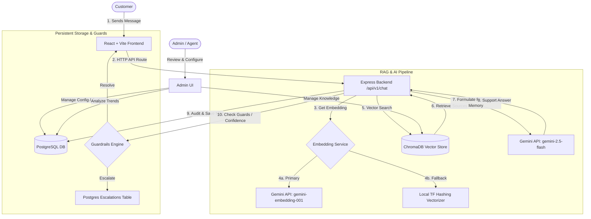

# 🤖 AI Customer Support Agent (RAG-Powered)

An enterprise-ready, full-stack customer support automation system. Built on a Retrieval-Augmented Generation (RAG) architecture using Express, React, PostgreSQL, ChromaDB, and Google Gemini API (via LangChain).

The system automates handling customer queries using a dynamic semantic knowledge base, calculates response confidence, logs feedback, presents a dashboard with detailed business intelligence charts, and implements an automated escalation loop to hand over low-confidence/complex queries to human agents.

---

## 🏗️ System Architecture & Workflow

The system is designed with a decoupled frontend/backend structure, utilizing a vector database for semantic retrieval and a relational database for chat histories, configurations, and analytical insights.



---

## 🌟 Key Features

### 1. 💬 Interactive RAG-Powered Chatbot
* **Semantic Retrieval**: Queries retrieve the top 5 most relevant support chunks from ChromaDB before sending prompts to Google Gemini.
* **Smart Memory**: Utilizes conversation history/memory windowing to maintain contextual threads.
* **Deterministic Fallback Embeddings**: If the Gemini embedding service experiences outages or quota limits, the system falls back to a deterministic 384-dimensional term-frequency hashing vectorizer to prevent downtime.
* **Confidence Scoring**: Each response is assigned a calculated confidence score using:
  $$\text{Confidence} = (\text{RetrievalScore} \times 0.65) + (\min(\frac{\text{SourceCount}}{3}, 1) \times 0.20) + (\text{LengthFactor} \times 0.15)$$

### 2. 🛡️ Intelligent Escalation Engine
* **Keyword Safeguards**: Automatically triggers a human hand-off when customers request actions the AI cannot execute (e.g. `refund`, `cancel my order`, `change my email`, `charge`, `delete my account`).
* **Confidence Guardrails**: Conversation escalates to human agents if the confidence score drops below the admin-defined threshold.
* **Knowledge Gap Detection**: Triggers escalation when zero matching articles are retrieved from ChromaDB, or when the LLM responds that it cannot find the relevant information.

### 3. 📊 Executive Analytics & Admin Dashboard
* **Dynamic Analytics Charts**:
  * **Volume Trends**: Daily request counts (Interactive Recharts Line Chart).
  * **Resolution Ratios**: AI-resolved vs. Human-escalated tickets (Interactive Pie Chart).
  * **Topic Breakdown**: Category-wise request distribution (Interactive Bar Chart).
* **Unresolved Questions Tracker**: Highlights queries that triggered escalations so admins can see exactly what documentation is missing from the Knowledge Base.

### 4. 📚 Live Knowledge Base Management
* **Document Uploader**: Direct upload support for text files and PDFs, processed using automated sentence-splitting algorithms.
* **Article Editor**: Search, filter, edit, or add articles manually, with real-time embedding updates synchronized directly to ChromaDB.

### 5. ⚙️ Custom Persona Configurator
* **Custom Identity**: Tailor the bot name, welcome messages, and system instructions.
* **Real-time Rules**: Adjust the confidence threshold sliding scale and change fallback responses instantly.

---

## 💻 Tech Stack

### Backend
* **Runtime**: Node.js & Express (ES Modules)
* **AI & LLM**: Google Gemini API (`@google/generative-ai`), LangChain (`@langchain/core`, `@langchain/google-genai`)
* **Vector Store**: ChromaDB
* **Relational Database**: PostgreSQL (client via `pg`)
* **Libraries**: `pdf-parse` (for PDF processing), `zod` (validation), `multer` (file uploads)

### Frontend
* **Framework**: React 19 + Vite
* **Styling**: TailwindCSS & Lucide Icons
* **Charts**: Recharts
* **Markdown Rendering**: React Markdown & Remark GFM

---

## 📂 Project Structure

```txt
├── backend/
│   ├── src/
│   │   ├── ai/            # Gemini & LangChain prompt chain definitions
│   │   ├── config/        # Environment configurations & database connections
│   │   ├── controllers/   # Request and response controllers
│   │   ├── database/      # SQL schema migrations and demo seed scripts
│   │   ├── middleware/    # Error handling, logging, and validations
│   │   ├── repositories/  # Database access layer (PostgreSQL)
│   │   ├── routes/        # Express router mount points
│   │   ├── services/      # Core business logic (RAG, Chat, Escalation, Analytics)
│   │   ├── utils/         # Helper functions (logging, confidence scores)
│   │   ├── validators/    # Zod payload validators
│   │   └── vector/        # ChromaDB clients and retrieval helpers
│   ├── package.json
│   └── nodemon.json
│
├── frontend/
│   ├── src/
│   │   ├── api/           # Axios API connectors to the backend
│   │   ├── components/
│   │   │   ├── admin/     # Settings, escalations, KB, and analytics graphs
│   │   │   ├── chat/      # Conversation bubble list, input fields, header
│   │   │   └── layout/    # App shell, responsive sidebar
│   │   ├── hooks/         # React hooks for API state integration
│   │   ├── index.css      # Core styles & Tailwind directives
│   │   └── main.jsx       # App entry point
│   ├── package.json
│   └── tailwind.config.js
│
├── docs/
│   └── RUN_LOCALLY.md     # In-depth setup guide and test cases
└── docker-compose.yml     # Local services (PostgreSQL & ChromaDB)
```

---

## 🚀 Getting Started

Follow these quick commands to spin up the application. For detailed, step-by-step setup guides, refer to the [Local Run Guide (docs/RUN_LOCALLY.md)](file:///Users/aadish/Desktop/AI%20%20Support%20Agent/docs/RUN_LOCALLY.md).

### 1. Run Databases (Docker)
Start the PostgreSQL and ChromaDB containers in the background:
```bash
docker compose up -d
```

### 2. Set Up Backend Env & Dependencies
```bash
cd backend
cp .env.example .env
```
Open `backend/.env` and update the `GEMINI_API_KEY`:
```env
GEMINI_API_KEY=your_gemini_api_key_here
```
Now install packages, run SQL schema migrations, and load demo support documents into ChromaDB:
```bash
npm install
npm run migrate
npm run seed
npm run dev
```
The backend API service is hosted at `http://localhost:5050` (healthcheck: `http://localhost:5050/health`).

### 3. Run Frontend App
In a new terminal window:
```bash
cd frontend
cp .env.example .env
npm install
npm run dev
```
Open the Vite local URL, usually at `http://localhost:5173`.

---

## ⚡ API Endpoints Summary

| Endpoint | Method | Description |
| :--- | :--- | :--- |
| `/health` | `GET` | System health check status |
| `/api/v1/chat` | `POST` | Send chat message & trigger RAG orchestration |
| `/api/v1/chat/sessions/:id` | `GET` | Get message history for a session |
| `/api/v1/knowledge` | `GET` / `POST` | List or manually add knowledge base articles |
| `/api/v1/knowledge/upload` | `POST` | Upload PDF/text file to extract and sync to ChromaDB |
| `/api/v1/feedback` | `POST` | Log customer thumbs-up/down ratings and comments |
| `/api/v1/escalations` | `GET` / `POST` | View list of active human-escalations / resolve escalations |
| `/api/v1/analytics/overview` | `GET` | Fetch metrics, trends, topic graphs, unresolved questions |
| `/api/v1/analytics/settings` | `GET` / `PUT` | Read/Write global agent settings (Persona, thresholds) |

---

## 🛠️ Testing the Setup

To verify that the RAG pipeline and escalation guardrails are running correctly, open the chat page and try the following queries:

1. **Successful RAG Answer**:
   > *"My laptop battery drains quickly."*
   > *Response:* Will return specific steps (e.g. background apps, battery saver mode, calibration) retrieved from the seeded knowledge base documents with a high confidence score.

2. **AI Action Guardrail Escalation**:
   > *"I was charged incorrectly and want a refund."*
   > *Response:* Triggers the keyword check for `refund`. The system will reply: *"This request requires human assistance. Connecting you to a support specialist..."* and create a record in the Admin Escalations queue.

3. **Knowledge Base Gap Escalation**:
   > *"How do I fix a broken spaceship engine?"*
   > *Response:* Will not find any matching docs in ChromaDB. The system will fall back, notify that it cannot find relevant info, and escalate the query to the human agent queue.
